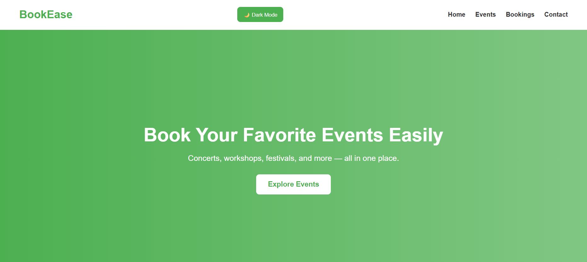

# BookEase

## Overview

BookEase is an Event Booking Web Application developed using HTML, CSS, and JavaScript. The platform enables users to browse events, search for events, book tickets, and manage booking history through an interactive and user-friendly interface.

The project demonstrates key frontend development concepts such as DOM manipulation, responsive web design, local storage integration, and event-driven programming.

---

## Features

- Modern landing page interface
- Event search functionality
- Interactive booking popup form
- Booking confirmation system
- Booking history tracking
- Local Storage support (data persists after refresh)
- Dark mode functionality
- Responsive mobile-friendly design

---

## Technologies Used

- HTML5 – Application structure
- CSS3 – Styling and responsive design
- JavaScript – Dynamic functionality and interactivity

---

## Project Structure

```txt
BookEase/
│── index.html
│── style.css
│── script.js
│── README.md
```

---

## How to Run the Project

1. Clone the repository:

```bash
git clone https://github.com/Harichandana-30/BookEase.git
```

2. Open the project folder in Visual Studio Code

3. Run `index.html` using Live Server

---

## Project Preview




## Key Learning Outcomes

- DOM Manipulation
- JavaScript Event Handling
- Local Storage Implementation
- Responsive Web Design
- UI/UX Design Principles
- Interactive Frontend Development

---

## Future Enhancements

- User Authentication System
- Payment Gateway Integration
- Backend Database Support
- Real-Time Booking Management

---

## Author

Harichandana